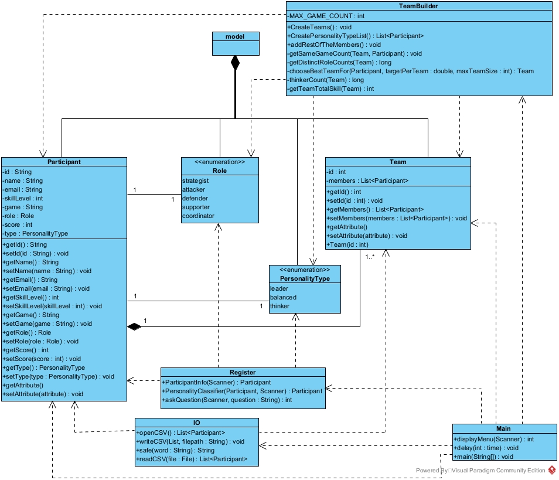
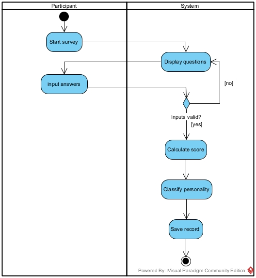

# TeamMate  
**Intelligent Team Formation System for University Gaming Clubs**

TeamMate is a **Java-based console application** that intelligently forms balanced teams for a university gaming club.  
It registers participants, evaluates their **skills, roles, and personality traits**, and creates teams using a rule-based and score-driven algorithm with concurrency support.

---

## Features

- Load participants from a **CSV file**
- Register participants **manually via console**
- Personality classification using a **multi-question survey**
- Concurrency support during survey execution
- Intelligent team formation based on:
  - Personality type
  - Skill level balancing
  - Role distribution
  - Team size constraints
- View all participants and teams
- Export formed teams to **CSV**

---

## Tech Stack

- **Language:** Java  
- **Concurrency:** `ExecutorService`, `Future`
- **UI:** Console-based (ASCII banner + menu)
- **Data Storage:** CSV files
- **IDE:** IntelliJ IDEA (recommended)

---

## Project Structure

```text
TeamMate/
├── docs/
│   └── uml/
│       ├── ClassDiagram.jpg
│       ├── MainSequenceDiagram.jpg
│       ├── openCSVSequenceDiagram.jpg
│       ├── ActivityDiagram_formTeams.jpg
│       └── ActivityDiagram_PersonalityClassifier.jpg
├── src/TeamMate/
│   ├── Main.java
│   ├── IO.java
│   ├── Register.java
│   ├── TeamBuilder.java
│   └── Model.java
├── .gitignore
└── README.md
```

---

## UML Diagrams

### Class Diagram


### Sequence Diagram - openCSV


### Sequence Diagram - Main


### Activity Diagram - Form Teams


### Activity Diagram - Personality Classifier


---

## Data Model

### Participant Attributes
Each participant contains:

- `id` (String)
- `name` (String)
- `email` (String)
- `game` (String)
- `skillLevel` (int: 1–10)
- `role` (enum)
- `score` (int)
- `personalityType` (enum)

### Roles
```text
strategist | attacker | defender | supporter | coordinator
```

### Personality Types
```text
leader | balanced | thinker
```

---

## CSV Format

### Import CSV (Load Participants)   

CSV must contain 8 columns in the following order:
```csv
id,name,email,game,skillLevel,role,score,personalityType
```

Example:  
```csv
P01,Alice,alice@email.com,Valorant,7,attacker,18,leader
P02,Bob,bob@email.com,CSGO,6,defender,14,balanced
```

- Invalid or incomplete rows are skipped automatically
- File selection uses a file chooser dialog

### Export CSV (Formed Teams)
 
The exported CSV includes a header and flattens teams as:  
```csv
Team ID,Participant ID,Name,Email,Game,Skill Level,Role,Personality Score,Personality Type
```

---

## How to Run
**Requirements**  
* Java JDK 8+ (11 or 17 recommended)

### Option 1: IntelliJ IDEA (Recommended)

1. Open IntelliJ IDEA
2. File → Open → select the TeamMate project
3. Ensure a valid Project SDK (JDK) is set
4. Run:
  ```
  src/TeamMate/Main.java
  ```

### Option 2: Terminal
```bash
# Compile
javac -d out $(find src -name "*.java")

# Run
java -cp out TeamMate.Main
```

---
## Application 

1. Load data from a CSV file
2. Register participant manually
3. See all participants
4. Form teams
5. See all teams
6. Save formed teams to a CSV file
7. Exit

---

### Admin Access

Certain actions require admin authentication.  
**Credentials (hardcoded):**  
```
Username: admin
Password: admin
```

Used for:
* Loading CSV files
* Exporting formed teams

---

## Team Formation Logic (Summary)

1. Leaders are distributed first to seed teams
2. Remaining participants are grouped by personality type
3. Skill level balancing minimizes team variance
4. Role duplication limits are enforced
5. Concurrency is used to evaluate placement efficiently
6. Teams are finalized once size constraints are met

---

## Known Limitations & Improvements

1. Admin credentials are hardcoded (should be externalized)
2. CSV export path is currently fixed in Main.java
3. No build tool (Maven/Gradle) yet
4. Console-only UI

---

## Suggested Enhancements

1. Add Maven or Gradle build support
2. Allow dynamic CSV export paths
3. Add unit tests for TeamBuilder logic
4. Provide sample CSV files in /data
5. Add documentation diagrams

---

## Author

Developed by **Chanthul4054**


